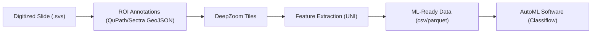

# Whole Slide Imaging (ROI Annotations to ML Ready Embeddings)


**Objective:** Provide a production-grade, tool-agnostic pipeline that turns whole-slide images (WSI) and pathologist annotations into ML-ready datasets.

**Overview:** This package standardizes ROI annotations (from QuPath, Sectra, or any tool that can export GeoJSON), builds DeepZoom tiles, extracts UNI embeddings, and writes reproducible Parquet outputs with full provenance.

This repository provides:
- A project-based workflow (`wsi init`) with a strict directory layout and medallion outputs (bronze/silver/gold).
- Slide-based workflow (`wsi slide run`) for quick single-slide runs using the same schemas.
- ROI GeoJSON v1 standard (tool-agnostic contract) plus adapters for QuPath and Sectra.

**Workflow diagram:**


**Important:** UNI model weights must be provided locally at `models/model.pth`. The pipeline never downloads weights.

## Install

### Micromamba (recommended)

```bash
micromamba create -n wsi-pipeline -c conda-forge python=3.10
micromamba activate wsi-pipeline
micromamba install -c conda-forge openslide openslide-python libxml2 icu
pip install -e ".[dev]"
```

### pip (existing env)

```bash
pip install -e ".[dev]"
```

## Start-to-Finish (Project Mode)

1. Initialize a project
```bash
wsi init /path/to/my_project
```

2. Add slides
- Copy SVS (or supported) files into `slides/raw/` (or symlink).
- Scan inventory:
```bash
wsi slides scan --project /path/to/my_project
```

3. Define labels
Edit `labels/labels.yaml` and make sure all annotation labels are included.

4. Annotate ROIs (tool-agnostic)
- Use QuPath, Sectra, or another tool to draw polygon ROIs.
- Export **ROI GeoJSON v1** (required contract) with slide pixel coordinates (level 0).
- Place each file at:
  `annotations/raw/<tool>/<slide_id>.geojson`

5. Build canonical ROIs
```bash
wsi rois build --project /path/to/my_project --tool generic_geojson_v1
```

6. Build DeepZoom tiles
```bash
wsi deepzoom build --project /path/to/my_project --tile-size 256 --overlap 0 --limit-bounds true
```

7. Build labeled tiles + PNGs
```bash
wsi tiles build --project /path/to/my_project --label-overlap-threshold 0.2 --tissue-frac-threshold 0.2 --save-png true --only-labeled --max-dzi-level 2
```

8. Extract UNI features
```bash
wsi features extract --project /path/to/my_project --model-path /path/to/my_project/models/model.pth --batch-size 64 --device cuda --only-labeled --max-dzi-level 2
```

9. Build dataset parquet
```bash
wsi dataset build --project /path/to/my_project
```

10. Outputs (tree)
```
project/
  bronze/
    deepzoom/
    tile_pngs/
  silver/
    rois/rois.parquet
    tiles/tiles_*.parquet
    tiles/tiles.parquet
  gold/
    features/
    dataset/
  manifests/
```

## Slide Mode (Quick Test)

Run the full pipeline for a single slide + ROI export:

```bash
wsi slide run \
  --slide-path /path/to/slide.svs \
  --roi-path /path/to/slide.geojson \
  --out-dir /tmp/wsi_slide_run \
  --model-path /tmp/wsi_slide_run/models/model.pth
```

This creates a project-like directory under `--out-dir` with the same outputs and schemas.

## Project Directory Structure

When you run `wsi init <project_dir>`, this structure is created:

```
<project_dir>/
  README.md
  project.yaml
  labels/labels.yaml
  slides/
    raw/
    manifest.csv
  annotations/
    raw/
      qupath/
      sectra/
      generic/
    canonical/
      rois.geojson
  models/
    model.pth
  bronze/
    deepzoom/
    tile_pngs/
  silver/
    rois/rois.parquet
    tiles/tiles.parquet
  gold/
    features/
    dataset/
  manifests/
  logs/
```

## ROI GeoJSON v1 (Required)

**One file per slide**: `annotations/raw/<tool>/<slide_id>.geojson`

**Coordinate system** (critical):
- Slide pixel coordinates at **level 0** (OpenSlide base level)
- `x` increases to the right, `y` increases downward
- Units are pixels (not microns)

**Required properties per feature**:
- `annotation_id` (string)
- `label` (string)

**Recommended**:
- `annotator`, `tool`, `created_at`, `notes`, `confidence`

**Example**:
```json
{
  "type": "FeatureCollection",
  "features": [
    {
      "type": "Feature",
      "geometry": {
        "type": "Polygon",
        "coordinates": [[[0,0],[100,0],[100,100],[0,100],[0,0]]]
      },
      "properties": {
        "annotation_id": "roi-001",
        "label": "tumor",
        "annotator": "dr_smith",
        "tool": "qupath",
        "created_at": "2025-01-01T12:00:00Z",
        "notes": "high cellularity",
        "confidence": 0.9
      }
    }
  ]
}
```

## QuPath Export Guidance

Use this QuPath script snippet to export ROI GeoJSON v1:

```javascript
// QuPath script: export ROI GeoJSON v1
import qupath.lib.roi.RoiTools
import qupath.lib.objects.PathObject
import qupath.lib.io.GsonTools

def imageData = getCurrentImageData()

def annotations = getAnnotationObjects()

def features = annotations.collect { PathObject obj ->
    def roi = obj.getROI()
    def geom = RoiTools.getShape(roi)
    def coords = geom.getPathIterator(null)
    def points = []
    double[] buffer = new double[6]
    while (!coords.isDone()) {
        int segType = coords.currentSegment(buffer)
        if (segType == java.awt.geom.PathIterator.SEG_MOVETO || segType == java.awt.geom.PathIterator.SEG_LINETO) {
            points << [buffer[0], buffer[1]]
        }
        coords.next()
    }
    // Close polygon
    if (points.size() > 0 && points[0] != points[-1]) {
        points << points[0]
    }
    def classification = obj.getPathClass()?.getName() ?: "unknown"
    return [
        type: "Feature",
        geometry: [
            type: "Polygon",
            coordinates: [points]
        ],
        properties: [
            annotation_id: obj.getID().toString(),
            label: classification,
            annotator: "",
            tool: "qupath",
            created_at: ""
        ]
    ]
}

def geojson = [type: "FeatureCollection", features: features]

def outPath = buildFilePath(PROJECT_BASE_DIR, "annotations", "raw", "qupath", imageData.getServer().getMetadata().getName() + ".geojson")
GsonTools.getInstance().toJson(geojson, new FileWriter(outPath))
```

If your QuPath export differs, use the `qupath_geojson` adapter.

## Adapters

- `generic_geojson_v1` (required): reads ROI GeoJSON v1.
- `qupath_geojson`: maps QuPath export to ROI GeoJSON v1.
- `sectra` (scaffold): update once Sectra export format is known.

## Schemas

`rois.parquet`:
- `slide_id` (string)
- `annotation_id` (string)
- `label` (string)
- `geometry_wkt` (string)
- `bbox_x0`, `bbox_y0`, `bbox_x1`, `bbox_y1` (float)
- `area` (float)
- `annotator`, `tool`, `created_at`, `notes` (string, optional)
- `confidence` (float, optional)

`tiles.parquet`:
- `slide_id`, `tile_id` (string)
- `dzi_level`, `tile_col`, `tile_row` (int)
- `x0`, `y0`, `w`, `h` (float; level-0 pixels)
- `label` (string, optional)
- `roi_ids` (list<string>)
- `roi_overlap_frac` (float)
- `tissue_frac` (float)
- `qc_flags` (list<string>)
- `tile_png_path` (string, optional)
- `split` (string, optional)

`tile_features.parquet` (partitioned by `slide_id`):
- `slide_id`, `tile_id` (string)
- `encoder` (string, always `UNI`)
- `model_sha256` (string)
- `embedding` (list<float32>)

`dataset.parquet`:
- Join of tiles + features on `slide_id`, `tile_id`
